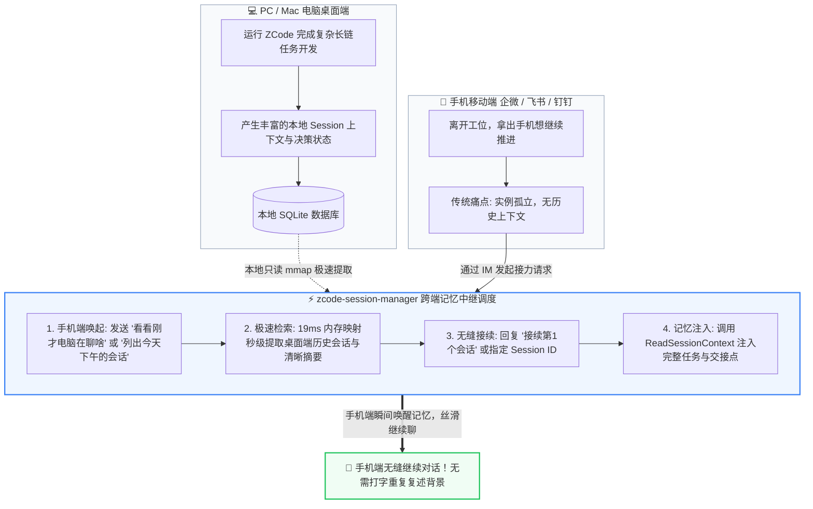
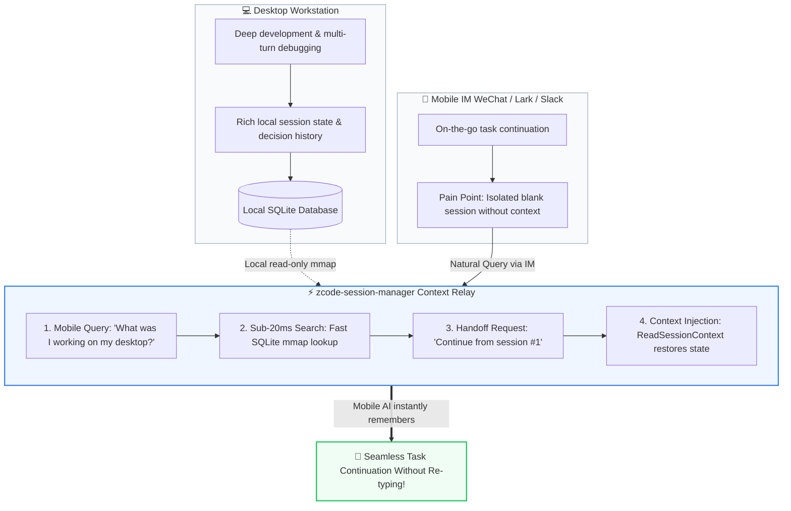

<div align="center">

# ⚡ ZCode Session Manager (`zcode-session-manager`)

**让手机 IM 随时无缝接续电脑桌面端 AI 完整会话的高性能跨端记忆中继器**  
*An ultra-fast (<20ms) session manager & cross-device context relay for ZCode / AI Coding Agents.*

[](LICENSE)
[](https://www.python.org/)
[-brightgreen?style=flat-square&logo=lightning)](https://github.com/)
[](https://github.com/)
[](https://github.com/)

[🇨🇳 中文文档](#-中文文档) • [🇬🇧 English Documentation](#-english-documentation)

</div>

---

## 🇨🇳 中文文档

### 📱 诞生背景与痛点破解：跨端无缝接续（电脑桌面 ⇄ 移动端 IM）

#### 1. 真实业务痛点
随着企业将 ZCode / AI Coding Agent 接入即时通讯软件（如**企业微信、飞书、钉钉、Slack 等移动端 IM**），一个高频且令人抓狂的体验断层随之出现：
- **跨设备上下文黑洞**：在办公室电脑桌面端用 ZCode 调试了一下午代码、梳理了复杂的重构架构或排查方案。合上电脑离开工位后（通勤路上、会议室或居家），拿出手机在企业微信/钉钉里想继续跟同一个 AI 推进任务。
- **对话割裂与“失忆”**：移动端 IM 接入的每次对话往往是一个全新的会话实例，**手机端根本无法读取电脑本地桌面端的历史上下文**。AI 宛如初见，对几分钟前在电脑上讨论的设计细节一无所知。
- **极高的重复录入成本**：在手机巴掌大的屏幕上打字繁琐费时，工程师被迫重新组织长篇大论向 AI 复述背景、粘贴代码片段，导致移动办公协同体验极其痛苦。
- **本地数据库壁垒**：ZCode 桌面端的全量会话历史保存在本地 SQLite 中，无法直接被移动端 IM 实例感知。

#### 2. 破局方案：`zcode-session-manager` 作为“跨端记忆中继器”

通过 `zcode-session-manager`，手机端与电脑端之间的记忆鸿沟被彻底填平：



### 🚀 核心特性

- ⚡ **内核级极速响应**：启用 256MB SQLite 内存映射（I/O mmap）与只读安全事务，全表毫秒级无感返回（< 20ms），绝不锁库冲突。
- 🎨 **终端丝滑对齐**：自适应当前终端列宽，内置标准库 CJK 全角中文字符对齐算法，超长标题平滑智能截断，**彻底告别折行爆屏**。
- 🕒 **人性化时序**：支持智能相对时间计算（“刚刚”、“40分钟前”、“昨天 17:41”），一眼掌握最近会话活跃状态。
- 📋 **一键提取与复制**：提供 `-c / --copy <序号>`，直接打印对应会话 ID，方便在手机端或 CLI 中一键输入“切到该会话”。
- 🔒 **纯离线与脱敏安全**：纯本地操作，零外部依赖，示例完全通用化脱敏。

### 🤖 极简交付：让 AI 帮您一键安装（推荐）

无需手动繁琐复制，将 `zcode-session-manager` 目录放在任意工作区，直接将以下提示词发送给您的 **ZCode Agent**：

```text
请帮我安装当前目录下的 zcode-session-manager 技能：将其复制部署到我的全局技能目录（~/.zcode/skills/zcode-session-manager/），确保包含 SKILL.md 与 scripts/list_sessions.py，并测试运行 list_sessions.py -n 3 验证安装成功。
```

### 💻 命令行速查 (CLI Cheat Sheet)

```bash
# 1. 默认极速浏览 (最新 25 条，终端自适应高亮 + 相对时间)
python ~/.zcode/skills/zcode-session-manager/scripts/list_sessions.py

# 2. 仅看今天活跃会话
python ~/.zcode/skills/zcode-session-manager/scripts/list_sessions.py -t

# 3. 关键字模糊搜索（按标题或 Session ID 过滤，命中词高亮）
python ~/.zcode/skills/zcode-session-manager/scripts/list_sessions.py -s "重构"

# 4. 快捷提取 ID：直接打印第 1 个会话的 ID (适合快速复制或命令管道)
python ~/.zcode/skills/zcode-session-manager/scripts/list_sessions.py -c 1

# 5. 指定拉取数量 (如最新 50 条)
python ~/.zcode/skills/zcode-session-manager/scripts/list_sessions.py -n 50

# 6. 输出标准 Markdown 表格 (适合直接复制给大模型或写入文档)
python ~/.zcode/skills/zcode-session-manager/scripts/list_sessions.py --md

# 7. 输出标准 JSON 格式 (适合工具链与程序自动化)
python ~/.zcode/skills/zcode-session-manager/scripts/list_sessions.py --json

# 8. 禁用色彩高亮 (输出纯文本)
python ~/.zcode/skills/zcode-session-manager/scripts/list_sessions.py --no-color
```

### 💬 自然语言交互指令

在手机 IM 或电脑桌面端 ZCode 中，随时使用自然语言唤醒：
- `“看看刚才电脑在聊什么”`
- `“列出今天下午的活跃会话”`
- `“帮我查找关于 <关键词> 的会话”`
- `“接续第 1 个会话继续工作”`
- `“读取会话 sess_xxx 的上下文背景”`

---

## 🇬🇧 English Documentation

### 📱 Motivation: Seamless Context Handoff (Desktop ⇄ Mobile IM)

#### 1. The Real-World Problem
As organizations connect ZCode and AI Coding Agents to mobile Instant Messaging platforms (such as **WeChat Work, Feishu/Lark, DingTalk, and Slack**), engineers encounter a major bottleneck:
- **Cross-Device Context Amnesia**: You spend hours debugging complex code, refactoring logic, and discussing architectures on your desktop workstation. When you step away from your desk, you open your mobile IM to continue working with the AI.
- **Isolated Instances**: Mobile IM creates a brand-new, isolated session. **The mobile client cannot access your local desktop SQLite database**. The AI responds like a stranger, unaware of previous discussions or decisions.
- **Tedious Mobile Typing**: Explaining project context and pasting code snippets on a mobile screen is inefficient and frustrating.

#### 2. The Solution: `zcode-session-manager` as Context Relay
`zcode-session-manager` bridges this gap seamlessly:
1. **Query via Mobile IM**: Send a simple message: *"What was I working on my desktop?"* or *"List today's sessions"*.
2. **Sub-20ms Retrieval**: Queries desktop session metadata in milliseconds using SQLite memory-mapped I/O (mmap).
3. **Instant Handoff**: Reply *"Continue from session #1"* or provide the target Session ID.
4. **Context Injection**: Uses `ReadSessionContext` (with `handoff` strategy) to inject previous tasks, code context, and next steps into your mobile conversation.



### 🌟 Key Highlights

| Feature | Description |
|---|---|
| **⚡ Sub-20ms Latency** | Powered by 256MB SQLite mmap I/O for zero-copy memory reads |
| **🎨 CJK-Aware Terminal UI** | Native CJK wide-character alignment prevents terminal line wrapping |
| **🕒 Humanized Timestamps** | Displays intuitive relative times ("just now", "10m ago", "yesterday") |
| **📋 Instant Session Copy** | `-c / --copy <INDEX>` prints Session ID directly for fast switching |
| **🔒 Zero Dependencies** | Pure Python standard library with zero external packages |

### 🤖 AI-Assisted Installation (Recommended)

No manual copying required. Place the `zcode-session-manager` directory in any workspace and send this prompt to your **ZCode Agent**:

```text
Please install the zcode-session-manager skill from the current directory: copy it to my global user skills directory (~/.zcode/skills/zcode-session-manager/), ensure SKILL.md and scripts/list_sessions.py are in place, and run list_sessions.py -n 3 to verify the installation.
```

### 💻 CLI Cheat Sheet

```bash
# 1. Default view (latest 25 sessions with adaptive columns & relative time)
python ~/.zcode/skills/zcode-session-manager/scripts/list_sessions.py

# 2. Filter today's active sessions only
python ~/.zcode/skills/zcode-session-manager/scripts/list_sessions.py -t

# 3. Fuzzy keyword search by title or session ID
python ~/.zcode/skills/zcode-session-manager/scripts/list_sessions.py -s "refactor"

# 4. Extract and print Session ID of index 1 (ideal for copy or piping)
python ~/.zcode/skills/zcode-session-manager/scripts/list_sessions.py -c 1

# 5. Fetch a specific number of records
python ~/.zcode/skills/zcode-session-manager/scripts/list_sessions.py -n 50

# 6. Output standard Markdown table format
python ~/.zcode/skills/zcode-session-manager/scripts/list_sessions.py --md

# 7. Output standard JSON format
python ~/.zcode/skills/zcode-session-manager/scripts/list_sessions.py --json

# 8. Disable ANSI colors (plain text output)
python ~/.zcode/skills/zcode-session-manager/scripts/list_sessions.py --no-color
```

### 💬 Natural Language Commands

Use natural language anytime in your mobile IM or desktop ZCode:
- *"What was I working on my desktop?"*
- *"List active sessions from this afternoon"*
- *"Search sessions related to <keyword>"*
- *"Continue from session #1"*
- *"Read context from sess_xxx"*

---

## 📄 License

Distributed under the [MIT License](LICENSE).
